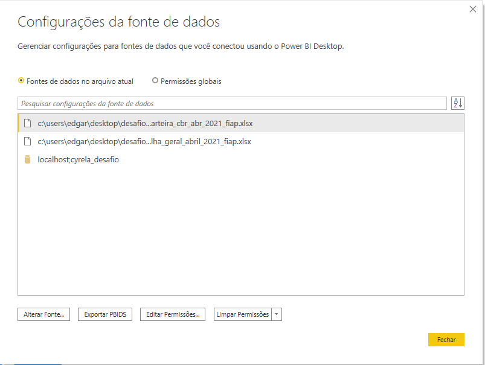

# Instruções de inicialização

## Banco de dados

Para a criação do banco de dados, utilizamos MySQL, pode ser executado com o [XAMPP](https://www.apachefriends.org/pt_br/index.html) e gerenciamento via phpmyadmin, ou com instalação direta do [Mysql](https://dev.mysql.com/downloads/mysql/) e gerenciamento através do Mysql Workbench. Passos para instalação do banco de dados:

1. Crie um banco de dados chamado "cyrela_desafio", através do Mysql Workbench ou Phpmyadmin (no caso de utilizar xampp);
2. Execute o script sql "dados/cyrela_desafio.sql" no banco de dados criado;
3. Após esta execução, o banco deve conter tabelas como controlesessao, coobrigado, log_navegacao, paginas, parcela, posicaofinanceira

## Arquivos de dados (Excel)

Os arquivos de dados excel estão todos localizados dentro da pasta Dados, na pasta base do projeto, estes são: Planilha_carteira_cbr_abr_2021_FIAP.XLSX e Planilha_geral_abril_2021_FIAP.XLSX

## Power BI

O arquivo para inicialização do Power BI está na raiz do projeto, com o nome "cyrela - pb.pbix". Nele, devemos apontar os arquivos de dados e fazer a iniciaziação do banco de dados.

1. Após abrir o projeto, na aba "Página Inicial", clique na seta do menu "Transformar dados", e depois em "Configurações da fonte de dados"
2. Em "fontes de dados no arquivo atual", verifique se os arquivos com extensão XLSX, estão apontados para os arquivos do projeto base, em dados, de acordo com a instrução de arquivos de dado acima
3. Verifique se a conexão com o banco de dados está funcionando corretamente e apontado para o local correto, de acordo com a imagem anexa:
    